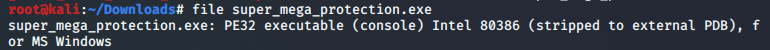
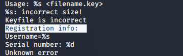
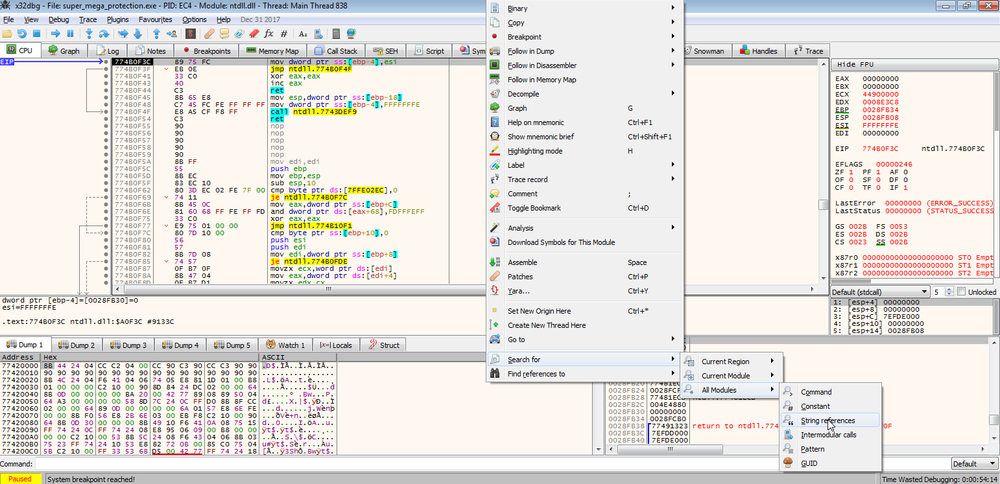
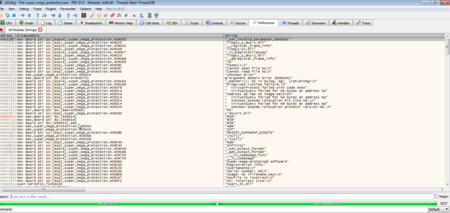
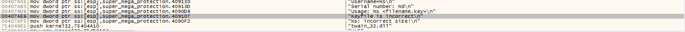
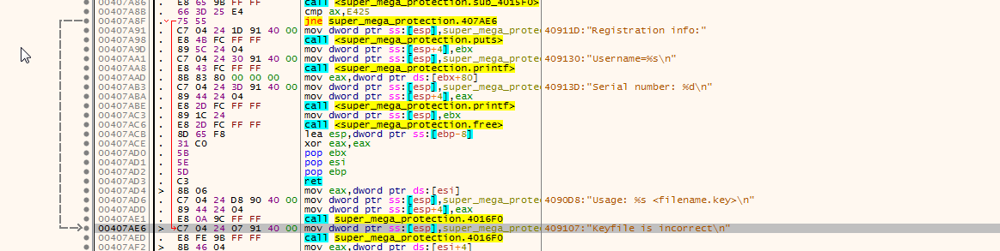
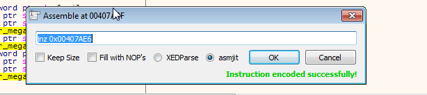
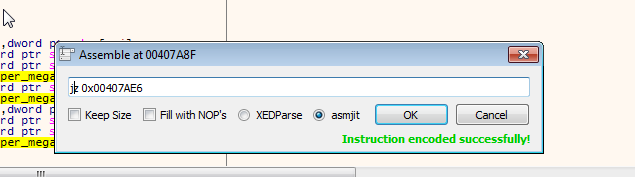

```Disclaimer : All the content provided below is for educational purposes only.```

So it was another usual day in our TCSC group when one of our friends gave us a reverse engineering challenge and asked us to solve it.The challenge is simple. He gave us a file and asked us to bypass the registration. Mind it everything is purely educational and no harm was done.So the details about the file which were given by our friend was that it was a imitation of a software copy protection. It uses a key file which contains a username and a key(serial number).

We were assigned two tasks.

In this blog we will talk about Task 1.

Task one was pretty simple. With the help of any debugger, force the program to accept a changed key file. Me being the optimistic bugger I am, opened my Kali VM and grabbed the file. I first ran a file command on it to identify what kind of a file it was.



Here’s the mistake I did. I should have switched to Windows and started running the file with a debugger on that. I derped by thinking I can do it on linux and went circles for hours till I finally gave up.

The **derps** I did.

I ran a `strings` command which was quite helpful as it showed me the strings in the program.



Then I ran a `gdb` on it. It obviously did not work.

`Pro Tip: Don’t start reverse engineering on a new file if you don’t know how it works.` 

Read up on it.

So after exhausting myself and draining all my energy at 4 am I decided to call it quits and slept off.

Next day morning I ran it on a Windows VM with a x32 dbg.

Viola! I was able to debug it. Also when I read up on PE32 files I found out that Portable executable files can’t be statically reverse engineered. They can only be dynamically reverse engineered (lesson learnt).

So after opening I ran a string references search on the debugger.



After letting it load completely I went through all the strings.



The one that I was most interested on was the “Keyfile is incorrect\n” string.



I double clicked on it to see the command which jumps to it. If you see closely there will be a red line pointing to the Keyfile is incorrect line.



That `jne super_mega_protection.407AE6` was the condition which points to ***key is incorrect*** output. If you click on that.. you’ll see this command in that address.



If you change the `jnz`(jump not zero) to `jz`(jump when zero). You’d have successfully bypassed the authentication process.



We have to click `OK` once and `cancel` the next one.

Thank you for reading.
